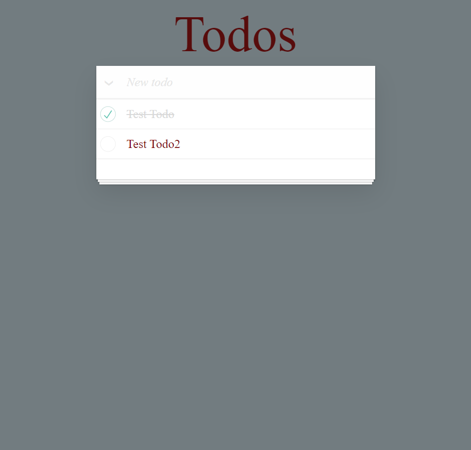

# TodoPractice
Ez a Todo app vue js.-ben készült a todomvc vue js. tutorial felhasználásával. Ez csak a gyakorlást szolgálja.

# Todo funkciók
Amikor először megnyitjuk az oldalt egy üres lista fogad bennünket, amely így néz ki.

A listához a szöveg dobozba beírva lehet emelet adni.

Az enter billentyű lenyomása után adódik hozzá az új elem a listához.

Ha belekattintunk a checkboxba, amely az elemek mellett van, akkor elvégzettnek tekintjük a feladatot, amely így néz ki.

A hozzáadás mellett van egy nyíl, amellyel az összes elemet késznek állíthatjuk be.

Az elemek mellett ha, belevisszük az egeret megjelenik egy piros x és erre rá kattinva lehet törölni az elemeket.

Az elemek módosíthatóak is, ha kétszer belekattintunk, ha kikattintunk belőle, vagy enter billentyűt nyomunk, 
akkor a módosul az elem, ha kitöröljük az elem teljes nevét modósítás közben, akkor az elem törlődik. Az esc billentyű lenyomásával visszavonható a modosítási szándék.

