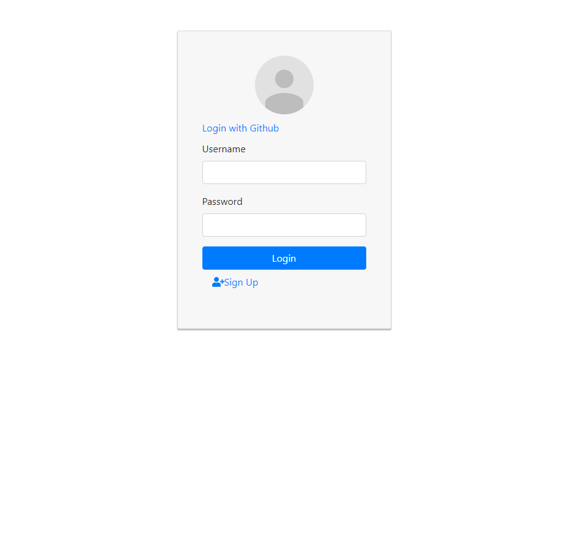
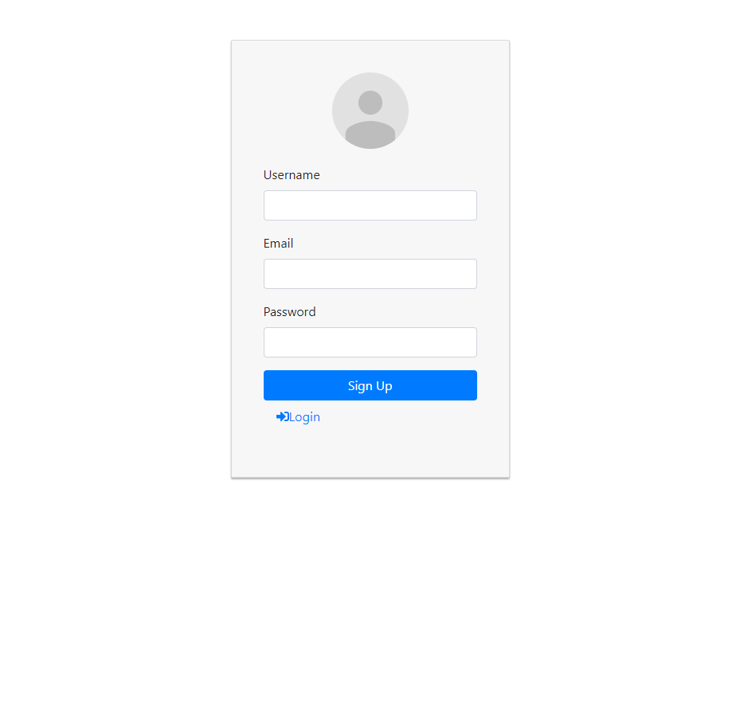
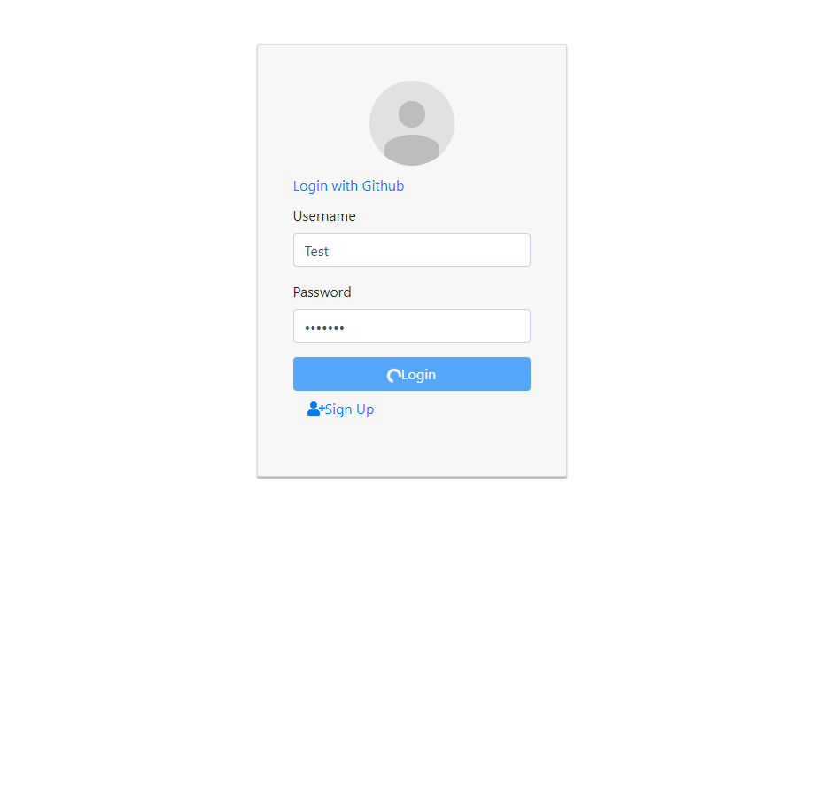
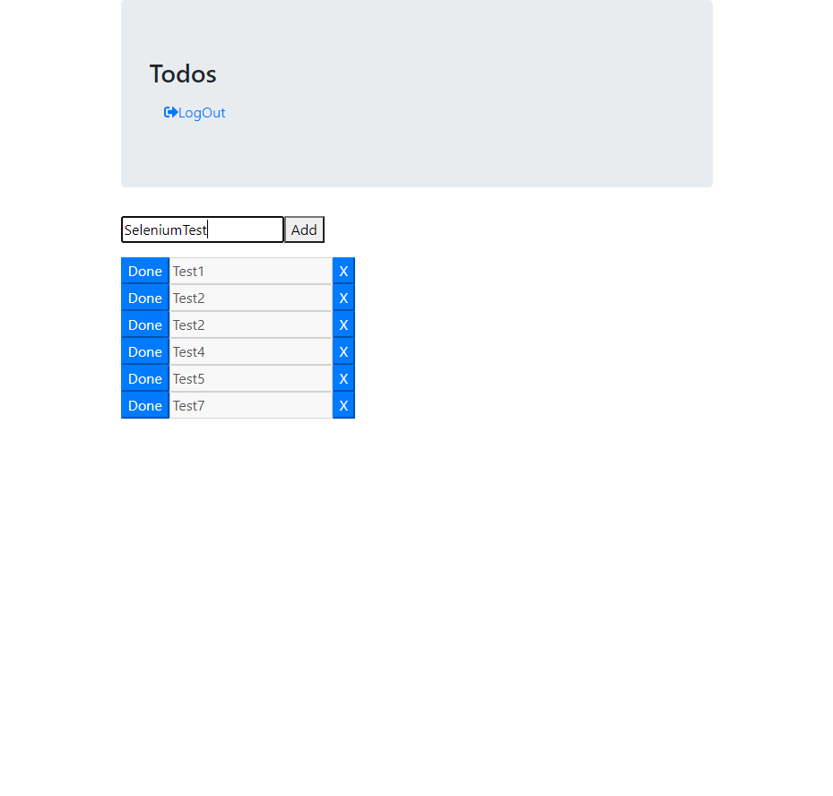
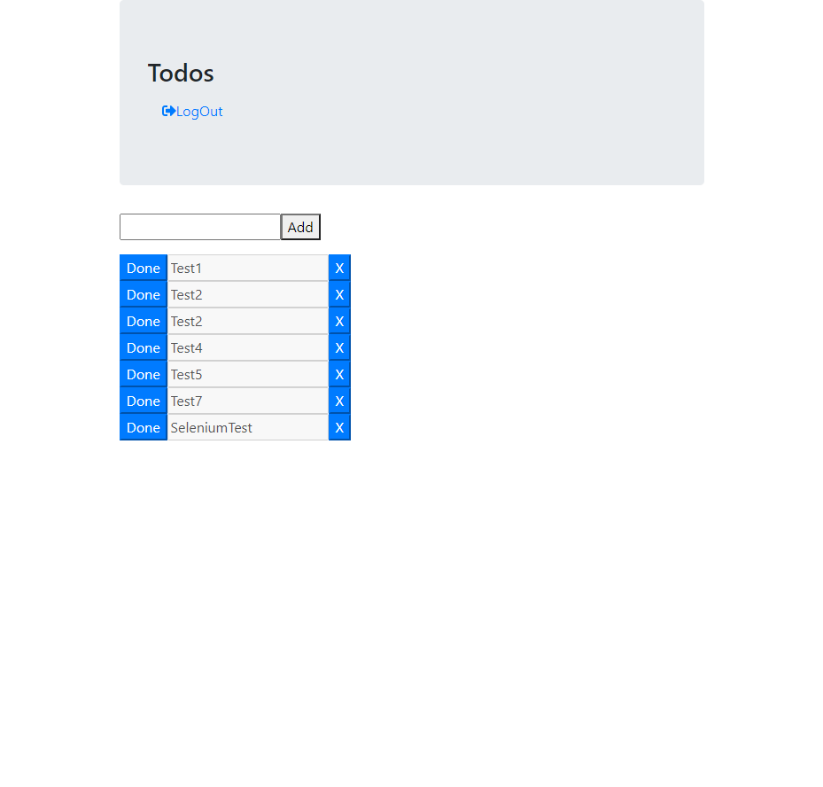

# Todo funkciók Userként

Amikor először megnyitjuk az oldalt egy üres bejelenkezési ablak fogad minket.

Ha nem rendelkezünk felhasználóval, akkor be regisztrálhatunk a regisztrációs ablaknál.

Bejelentkezéshez a felhasználó nevünkre és a jelszavunkra van szükség.

Bejelentkezés után a Todo lista fogad minket, ahol a done gomb megnyomásával kipipálhatunk egy todo-t,
amely ennek hatására áthúzódik.

Todo elemet úgy tudunk hozzáadni, hogy a felső szöveg dobozba beírjuka a todo szövegét, majd rákattintunk az add gombra

Az alkalmazásban van lehetőség a törlésre és a módosításra is, de ezen funkciók nem elérhetőek a userek számára. Modosítani az moderátor és az admin tud, de a törlésre már csak az admin képes.